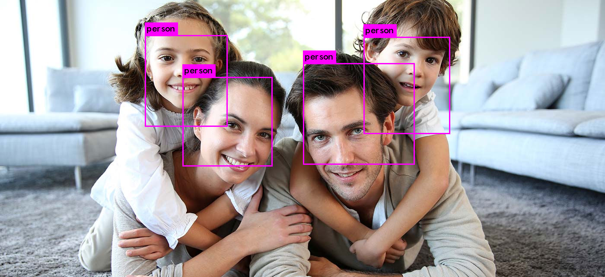
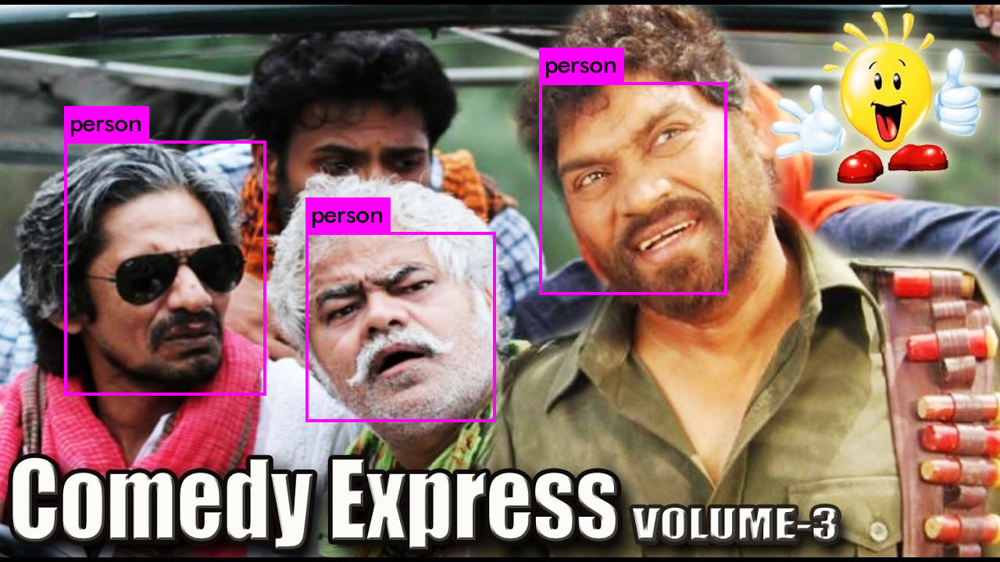
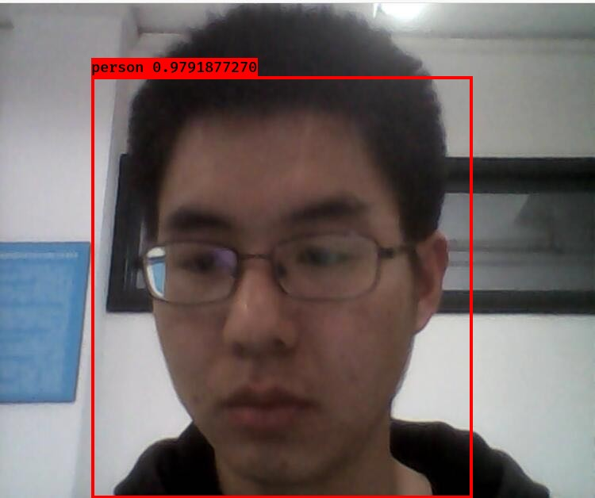

# RealTimeFaceDetection
基于YOLO-lite的web实时人脸检测（2.2MB大小，10FPS）

> 注：只需下载model文件夹以及index.html,main.js，置于同一目录下，再打开index.html即可实现Demo的效果。

Demo地址：[RealTimeFaceDetection](https://mxzf0213.github.io/RealTimeFaceDetection/)

效果展示：

若要在终端命令行下测试，可以：

1. 通过darknet深度学习框架测试（需要git下载）：

   1. 图片测试：

      `sudo ./darknet detector test faceData/covoc.data faceData/mycfg.cfg mycfg_final.weights your/jpg/path`

   2. 视频测试：

      `sudo ./darknet detector demo faceData/covoc.data faceData/mycfg.cfg mycfg_final.weights your/mp4/path -thresh 0.6`

2. 通过keras框架测试（在yad2k目录下，本项目只有部分文件，需要git下载）：

   `sudo python3 test_yolo.py yad2k/yolo_lite.h5 -a yad2k/yolo_lite_anchors.txt -c faceData/voc.names -t your/jpg/dir/ -o ./images -s 0.6 -iou 0.3`

相较于YoloV2模型，Yolo-lite做出的改动主要体现在将图片尺寸减半(从[416,416]到[224,224])，以及去掉BN层。具体可以参见[Yolo-lite论文](https://arxiv.org/pdf/1811.05588.pdf)。Yolo-lite从YoloV2中受到启发，所以更加详尽的原理描述建议看[YoloV2论文](https://arxiv.org/abs/1612.08242)。

Yolo-lite的效果在只有CPU环境下能够达到10FPS左右，在GPU环境下达到30FPS左右。虽然Yolo-lite的检测速度相较之前的Yolo模型大大提升(得益于网络规模的削减和丢弃BN层)，但并没有进一步提升准确率(mAP)的措施，所以相应地准确率会有所下降，这点是毋庸置疑的。

总的来说，Yolo-lite是一个很好的实时多目标检测模型。

<h2>项目流程目录</h2>

1. [数据准备、处理](#1)
2. [darknet框架准备以及相关文件设置](#2)
3. [GPU环境下训练](#3)
4. [测试Yolo-lite模型](#4)
5. [将cfg和weights文件转化为.h5文件并测试](#5)
6. [利用tensorflowjs_converter将.h5文件转化为JavaScript](#6)
7. [js编写对模型输出解码](#7)

<h2 id="1">数据准备、处理</h2>

本项目从kaggle网站上下载人脸数据，共包含408张图片，每张图片包含若干张人脸，以及人脸矩形框信息。

下载位置：[Face Detection in Images](https://www.kaggle.com/dataturks/face-detection-in-images)

下载之后得到的并不是图片文件，而是json文件，所以需要进行一些预处理，这里可以使用我写好的py文件

py文件位置：`faceData/process.py`

>  注：darknet是一个C语言的目标检测框架，训练时我们传入框架的参数有：.data文件和.cfg文件。
>
> .data文件参数包括：
>
> 1. 训练类别：classes = 1
> 2. 包含所有训练图片路径的txt：train = your/path/train
> 3. 包含所有测试图片路径的txt：test = your/path/test
> 4. 训练所得权重文件输出目录：backup = your/path/backup

这里运行py文件后我们会得到一个JPEGImages和labels文件夹，分别包含图片和相应的人脸信息，由于只有一个类别人脸，所以人脸信息中第一个参数始终为0，剩下的四个参数分别为人脸矩形框的中心x坐标，中心y坐标，宽度，高度，都在[0,1]之间(相对于原图片的大小)。另外需要注意train.txt和test.txt存放图片的绝对路径。

这样我们的数据就准备好了！

<h2 id="2">darknet框架准备以及相关文件设置</h2>

darknet框架下载位置：[darknet](https://github.com/pjreddie/darknet)

在下载下来之后，可以用其中训练好的cfg和weights文件进行一些测试，可以参考[darknet官网](https://pjreddie.com/darknet/)，这里不再赘述。

我们需要训练的是Yolo-lite模型，所以我们继续下载Yolo-lite的cfg文件。

Yolo-lite位置：[Yolo-lite](https://github.com/reu2018DL/YOLO-LITE)

Yolo-lite作者提到训练最好的模型是[tiny-yolov2-trial3-noBatch.cfg](https://github.com/reu2018DL/YOLO-LITE/blob/master/cfg/tiny-yolov2-trial3-noBatch.cfg)，所以我们这里只对该cfg文件进行训练。

cfg文件我们需要做一些改动以便适应我们的训练：

1. batch = 64，subdivisions = 4，表示一次训练64张图片，分4次送入网络，可根据自己需要设置。
2. max_batches = 10200，训练次数，可根据自己需要设置。
3. 最后一个convolutional层中filters = 30，以及region层classes = 1，filters计算公式为filters = num *  (classes + 5)。

接下来我们在训练前要对darknet进行一些文件设置，具体表现为：

1. Makefile：
   1. 1和2行，GPU=1，CUDNN=1，如果不选中的话采用CPU训练，速度很慢；
   2. 24行，NVCC=nvcc；
   3. 50行和52行根据本地CUDA目录设置。
2. detector.c：主要是train_detector函数中打印设置，可根据自己需要设置。
3. yolo.c：第3行voc.names数组改为只有“person”，以及train_yolo函数前两行文件位置修改；还有一些打印设置，可根据自己需要设置。

> 注：以上修改的文件在`faceData`文件夹中均能找到，可以直接拿来用或修改。

设置好后需要进行重新编译，即`sudo make clean`,`sudo make all`

<h2 id="3">GPU环境下训练</h2>

本项目训练运行在Google的免费GPU云环境中，其中已经内置好了CUDA，位置为`/usr/local`。

云环境位置：[colab](http://colab.research.google.com/)，新建.ipynb文件后需要设置笔记本为GPU运行，具体选项为[修改]->[笔记本设置]->[硬件加速器]->[GPU]。

.ipynb文件位于项目目录下的colabFace.ipynb，仅供参考，可以根据自己需要修改。

<h2 id="4">测试Yolo-lite模型</h2>

测试Yolo-lite模型可根据开头的终端命令行进行测试。

需要注意的是，如果想要在GPU下测试，才能达到30FPS的效果；如果要即时显示，需要启用OPENCV。

为此需要修改Makefile，GPU=1，CUDNN=1，OPENCV=1。

OPENCV的安装可参考网上博客教程，这里不再赘述。

需要注意的是，CUDNN的安装有如下三步，并且要按照顺序安装：

1. NVIDIA显卡驱动；
   1. 查看显卡命令，`lspci |grep -i vga`
   2. 到NVIDIA官网安装相应驱动并执行`reboot`重启
   3. 重启后终端输入`nvidia-smi`，安装成功会显示显存和GPU信息
2. CUDA；
3. CUDNN，需要注意与CUDA版本对应。

以上均可参照网上博客教程。

<h2 id="5">将cfg和weights文件转化为.h5文件并测试</h2>

需要提前下载好yad2k转化包以及keras。

yad2k下载位置：[yad2k](https://github.com/allanzelener/YAD2K)

keras通过pip安装。

在使用yad2k.py文件转换前注意修改第83行，修改16 -> 20，原因未知。

另外，还需修改第113行，改为batch_normalize = 0，以防止读取参数文件时部分参数被误读为BN层参数。

测试时可参照开头的终端命令行运行。

<h2 id="6">利用tensorflowjs_converter将.h5文件转化为JavaScript</h2>

需要提前安装keras、tensorflow、tensorflowjs，使用pip安装即可。

转换命令：

`tensorflowjs_converter --input_format keras yolo-lite.h5 tfjs_model_data`

<h2 id="7">js编写对模型输出解码</h2>

由于yolo-lite模型转换到.h5文件后已经丢失了detection(REGION层)，所以需要对输出的tensor[7,7,30]进行解码，在js文件中我们需要自己编写解码部分，可以参照darknet框架和yad2k的test_yolo.py。

概括来说，tensor[7,7,30]表示有7*7个子特征图(cell)，每个特征图预测5个不同尺寸的box，通过anchors数组进行控制，以适应多尺寸的目标检测；每个box包含6个参数，分别为[cx,cy,tx,ty,obj_conf,prob]；其中cx，cy表示相对于当前cell左上角，物体中心位置；tx，ty表示矩形框的宽和高相对于原始图片的比例；obj_conf表示该cell存在物体的概率；prob表示该cell中若存在物体，物体是各类别的概率，这里由于我们只有一个类别人脸，所以softmax后始终为1，可以忽略操作。

以上参数的解码部分在项目目录的main.js中实现。

要真正搞懂解码，需要了解YoloV2的原理；由于本人才疏学浅，这里不再展开，恐误导读者，有兴趣的同学可以学习一下YoloV2论文。

> 注：如果对模型的效果不满意，可以在main.js的第13行和第14行调节truth_thresh(置信度阈值)和nms_thresh(交并比阈值)。

<b>最后，如果你从中受到启发，请不吝留下你的star吧o(*￣▽￣*)ブ</b>
